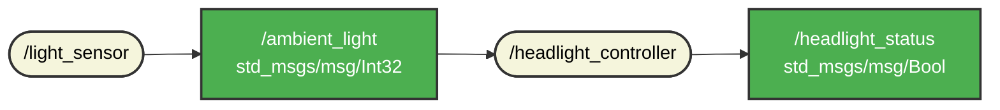

# `light_control` package
ROS 2 C++ package.  [](https://docs.ros.org/en/humble/)
A "light_control" package 2 node-ból áll. A publisher node a "light_sensor", ami a fényerősség mérésének szimulációjáért felelős. Ezen kívül szimulálja még a nappal-éjszaka ciklust is.
A "headlight_controller" a subscriber node, ez szimulálja a fényszóró automatikus vezérlését a fényerősség függvényében. Ha a fény adott érték alatt van felkapcsolja, ha adott érték felett, akkor pedig le. 
## Packages and build

It is assumed that the workspace is `~/ros2_ws/`.

### Clone the packages
``` r
cd ~/ros2_ws/src
```
``` r
git clone https://github.com/HKornell/hor_jwa_autonom.git light_control_pkg
```

### Build ROS 2 packages
``` r
cd ~/ros2_ws
```
``` r
colcon build --packages-select light_control_pkg --symlink-install
```

<details>
<summary> Don't forget to source before ROS commands.</summary>

``` bash
source ~/ros2_ws/install/setup.bash
```
</details>

``` r
ros2 launch light_control_pkg light_control.launch.py
```
### Mermaid diagram
